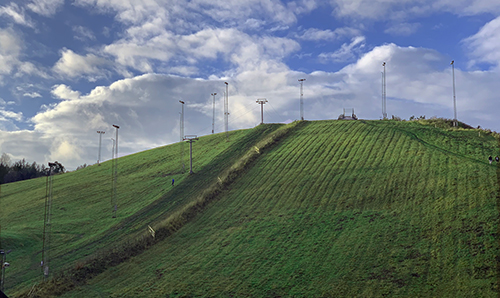

>*Reda*, I appreciate how you helped me in my moment of crisis when suffocating from anxiety, not knowing what the hell I was doing with the Terminal. In a crowded class you took the time to make sure I was up to date.  
For this, I thank you from the bottom of my heart. You'll be pleased to know I now use Terminal on a regular basis. I wouldn't say Terminal and I are friends yet but definitely heading in the right direction! Feel safe knowing every time I look at the terminal I think of you hahahah! Thank you for all your support and advice and support! 

- Adam

---

>Thank you *Reda*, for your invaluable feedback, endless patience and support. How are we going to manage without you? 🌟

- Agnes

---

>Hi *Reda*!  
I think you are the best in the role of our industry leader who basically introduced us and led us into Front-End world. I, and probably everyone else really appreciate you for being very understanding and supportive all along through our wins and struggles during this journey.  
 
These 2 modules were crucial, and certainly a struggle as for someone who just started, but atmosphere you've created as our leader was just best. We all really appreciate you, and I hope and wish you could stay here, guiding us for the rest of our journey as you did really great job in this role 😊

- Aleksandra

---

>Thank you *Reda* for everything you have taught us! I hope you know you are an inspiration to all of us!

><a href="https://open.spotify.com/album/7AyCBQsKKRpnE8wYIZjKeo" target="_blank">🎵🎸🎹🎻🎷</a>

- Alestry

---

> *Reda*, thank you for making difficult subjects so entertaining! And for being a great friend. Gonna miss that moustache on Zoom. Might take a screenshot and put your picture next to every Zoom meeting in the future just to cure my abstinence. 😉 🤗  
 
This is the concert I mentioned: <a href="https://www.svtplay.se/video/29057894/kite-pa-kungliga-operan" target="_blank">🎵🎸🎹🎻🎷</a>   
(And yes, I know them 😀)

- Anna 

---

>*Reda*, the coolest guy on the block!   
I don’t think I’ve ever had a lecturer that motivated me so much in learning more and more. You’ve made me more confident in coding and been a great inspiration during these last months.

- August

---

>Hey *Reda*! ✨   
First of all, I just want to say how amazing was to have you as our first industry leader. Starting to code from scratch with a totally different background was something that made me afraid of doing it. In the back of my mind, my fear was always to not be able to keep up. But with your support, always very attentive to all levels and different contexts that the class has, I was able to unleash the developer inside of me and surprise myself with my potential in the best possible way!   
 
And for that, I will always appreciate you. Thanks for all the knowledge and the friendship. You’re the best ✨🌟

    1/2

---

> <a href="https://link.tospotify.com/frq9sTF2Nbb" target="_blank">🎵🎸🎹🎻🎷</a> The best coding playlist 😂 It has been my best coding company, and who knows not yours too from now on! 😆

    2/2

- Cecilia Lobo 💛

---

>*Reda*, It's been a pleasure meeting and getting to know you these past months. I see you as an honest person, a good explainer, a thinker, and an excellent walking buddy! 😄 I hope this is not goodbye, and that we will stay in touch!   
🤩 Big hugs - and many many thanks for making this start of my Front end developer career so great!! 👩‍💻 🔜 🥇

- Cecilia Hallerby

---

>*Reda*, thank you for sharing your knowledge and guiding our coding journey!

- Emilia Manda

---

> I can’t imagine someone better to introduce us to the intimidating world of Frontend Development 
💻 Thank you *Reda* for always being patient, always being 100% present and giving us so much of your time and energy 💜 It would have been a million times harder without you ✨  
I hope to see you again soon!

- Ebba

---

>*Reda* — thank you for challenging me to think further, work harder and dream bigger. Thank you for the doors you have opened for me to this new programming world. Thank you for this past months, it have been a lot of fun!

- Elin Amrén

---

Thank you *Reda* for your support, patience, kindness, honesty, your ability to listen and for this fantastic start of our Hyper Island journey. You have really become a part of our crew and I will miss you! Hope you will join us at no name or at a random Windows XP hill nearby as soon as corona allows us. ⛰ Until then  - all the best!

- Elin Nordin

---

>Thank you so much *Reda* for starting off our Hyper journey in such a good way and making it fun and exciting to learn! Will miss you as our industry leader but I'll see you around (no name bar 😂)

- Elsa 

---

>*Reda*, we have been so lucky to have had you as our industry leader during these months.   
Your are a good teacher and have really made an effort to explain things to us in a comprehensive way. 
I appreciate your patience and humor and how you've taken the time to get to know us and hang out.

- Emilia Frisell

---

> *Reda*,   
It's been a pleasure to have you being the one to introduce us to the world of coding, and all the interesting people you brought to us! I hope you've enjoyed being our IL, I know I've enjoyed having you with us and I hope you'll come back again, at the very least stick around in Discord to watch us grow!

Take good care of yourself.

- Emma 

---

>*Reda*,  
Since the day at the bar near the school, I got the feeling that you would be a cool and great techar for all of us, and I'm glad I wasn't wrong. really appreciate that you took you time to explain things that gave us headache and you even made it fun. We really gonna miss you as a great teacher but  we still gonna meet up. Ecauae you are part of our group. Wish you the best in everything.

Para arriba, para abajo, para el centro y para adentro,
 SALUD!!

- Ephraim