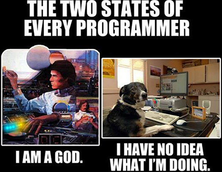
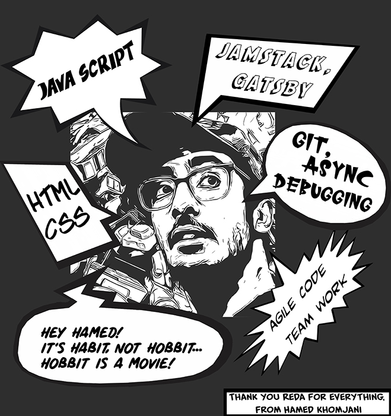
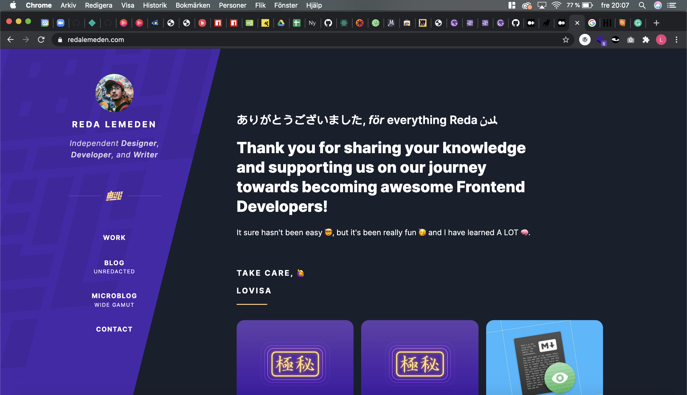

>Thank you *Reda* for guiding us through the highs and the lows of these past few weeks and for giving us a great start, wouldn't have been the same without you!

- Fanny Buhlér

---

>*Reda*  
It’s sad that you won’t be with us for this entire program because honestly it feels like you’re our teacher now. But I just wanted to thank you for introducing me to programming and keeping that interest up through out the modules. Thank you for all the time you put in and all the weird ways of doing things. I’m never gonna forget the random group generator. Wish you the best and hopefully we will cross paths sometime in the future 😊

- Fanny Johansson

---

>Thank you *Reda* for giving me the pleasure of being the industry leader and mentor for my first steps on my new Hyper Journey! The knowledge and insights you shared with us during this first period helped me gain confidence and feel hopeful for a better tomorrow within the industry. Thank you and hopefully will see each other again.

- Filippos

---

---

>*Reda*,  
Thank you always for the invaluable guidance you've provided and for always sharing your honest opinions.    
It's been a great experience having you as our first industry leader.

- Hamiat

---

>> *Reda*,    
>> Millions of thanks for the awesome leader with mustache! You have always been really great to us and we appreciate so much.

- Hopi

---

>*Reda*,    
Thank you so much Reda for paving the way for us on our journey to becoming developers. It has been such a rewarding experience and your patience and vise words has helped me to become better and more motivated to go forward with my journey! I really appreciate your hands-on approach to learning as well as your ability to put yourself in our shoes to best project your knowledge. I wish you all the best and thank you for everything 👏
  

- Karolin

---

>Hi *Reda*,   
Thank you for this time! Thank you for always being positive about our learning journey, and for always having something kind to say about our projects. It’s been fun! I hope we can all go out for a beer together again in the future!  

Take care!

- Linnéa

---

>Thank you *Reda* for making learning code..easier? Yeah, easier to grasp and definitely more structured and focused than I had imagined.

>It’s been challening not so say the least, but i’m thrilled of how much I’ve managed to learn. I’ve enjoyed following along your lectures and never felt them being irrelevant. Rather, shit my head is full, how am I supposed to squeeze another of these concepts in there... But somehow it works and I appreciate to keep being exposed to unfamiliar and complex concepts, just for the sake of hearing it and then later go back to dig deeper. 

    1/2...

---

> You have a calm and confident vibe that provide a feeling that anything is possible. Just that one need to take it easy and keep working...and working and then we’ll get there 😎  
I can’t come up with anything I wish would had been done differently, can only express my appreciation and the pity we’ll no longer have you leading the way.

THANK YOU 💜 
And see you around ✌🏽

    2/2 🤠

- Lisa

>[🎵🎸🎹🎻🎷](https://open.spotify.com/playlist/2Pn1DS81JBDlBbhJ948STu?si=ZHpkfWrNSDKwVt9MUCJiag) / [📻🎙](https://poolside.fm/lockdown)

---

