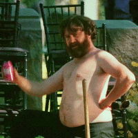
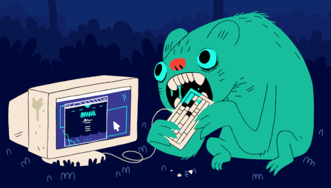

>Many thanks for these weeks *Reda*! You have taken us one step closer to becoming your future colleauge 😎 Good luck with your writing! 🙏🏻✍🏼😁

- Malin

---

>Thank you *Reda* for always being so flexible, funny, positive and honest.  
Thank you for all the inspiration you’ve given me, thank you for being such a great teacher and thank you for being such a good friend! 😃  
I hope I’ll see you out for a beer or two (or cider in your case lol)🍻 

Just thanks 

- Matilda 🕺🏼

---

>I can not believe that we made it to the end!  
This is a little appreciation message to let you know just how helpful you have been. You are such an amazing industry leader and I hope you know that — you were such a huge influence on me these months, you have made me excited and passionate about the program even more. I am grateful.

Thank you, *Reda*. 
XOXO

- Michaela ❤️

---

>Thank you *Reda*, for the time & knowledge you have shared with us.  And for making me realise that I shouldn’t be intimidated rather just be challenged and inspired to only get better. 😊

- Mithila

---

*Reda*, thanks for always supporting us, listening to our errors and debugging with us even during all the days we felt like this guy:

- Neha

> <a href="https://link.tospotify.com/Nr4NKmEdGbb" target="_blank">🎵🎸🎹🎻🎷</a>

---

>*Reda*,  
For these first modules, you were more vital than the <code>MDN Web Docs</code> to kick-start our new journey, more crucial than <code>npmjs</code> to enhance our code, better than <code>Stack Overflow</code> to be as our guardian angel and soothe our anxieties, and much more important than <code>Udemy</code>, <code>freeCodeCamp</code>, <code>Codecademy</code>, and etc., combined.  
Thank you for being an amazing mentor, a source of inspiration, and a good friend!

Good luck with everything!
- Omid

---

> I've been enjoying all your lectures since day one, *Reda* (that's something valuable coming from a real tech dummie as me). I also enjoyed your closeness and friendship attitude. I hope I can catch up on all the terminology to chat about nerd staff with you in the future. 

Thank you *Reda*!!

- Pablo

---

>*Reda*,   
Thank you for being a great role model and teacher, and an even better friend. I really appreciate the time you have taken to get to know us and spend the time with us. I feel inspired and motivated by you every time we get to hang out and after every lecture. I hope we can continue to talk after this module and long into the future. 

><a href="https://www.youtube.com/playlist?list=PLy_XgQYCeQlXnjTrzGY6hYoZibOdzKs5s" target="_blank">🎵🎸🎹🎻🎷</a>: The playlist I have been listening to on the Rythm bot, I update it regularly if you're ever looking for some tunes. Don't be a stranger 😊

- Paul

---

>🚀 I have really enjoyed that you have been more than a teacher with us, you are also our friend, which is a rare achievement.  
🚀 You laid back and humorous attitude is why I have looked forward to each lecture.  
🚀 You are very smart, honest and curious. Best mentor/friend one could wish for.  
Keep being awesome, don't forget us because we sure won't forget you, give me a job in the future please, don't shave that mustache

- Pebo 